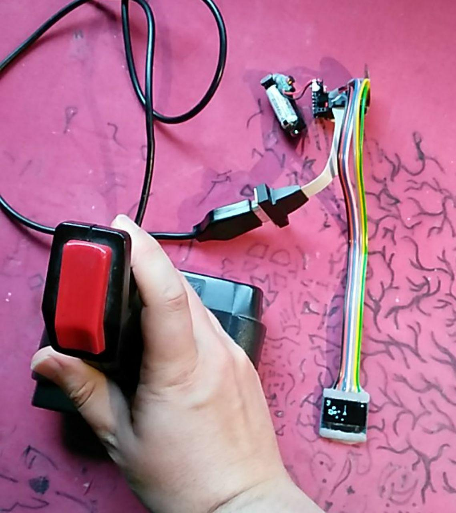

# Asteroiden

This is a very simple Asteroids clone (1979 Arcade game) for Arduino Pro Mini (8MHz, 3.3V) and an old Joystick (C64).

## Feature

- a intro melody (not original)
- prints (intro) and stores Highscore in EEPROM
- ONE LEVEL with 3 lives and 3 asteroids (max. 27 parts)
- asteroids split into 3 smaller parts. Smaller Parts split into little parts.
- Game Over screen with your score
- random speed and start position of the rocks
- Game Over fail sound (not original)

## Picture

## Pinout

    up     A1  -> C64 Joystick Pin 1
    down   A0  -> C64 Joystick Pin 2
    right   2  -> C64 Joystick Pin 4
    left    3  -> C64 Joystick Pin 3
    fire    7  -> C64 Joystick Pin 6
    
    GND        -> C64 Joystick Pin 8
    3.3V       -> C64 Joystick Pin 7
    piezo Beeper: 5

Because the most auto fire need more than 3.3 Volts, auto fire will not work.
